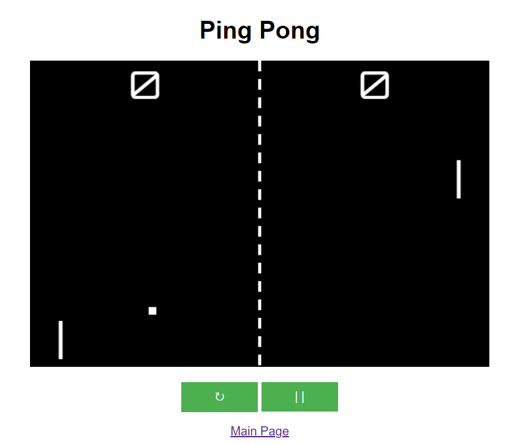

# Pong

## Description
You can play the classic game of <a href="https://en.wikipedia.org/wiki/Pong">Pong</a>. The game provides the option to play against another human being or to play with the computer.

## Sources
### Audio
Ping Pong Sound: https://freesound.org/people/pan14/sounds/263133/  
Wall Collision Sound: https://freesound.org/people/timgormly/sounds/170141/

## TODO
- Seperate difficulty levels for the computer (idea: just foresee a certain amount of steps)
